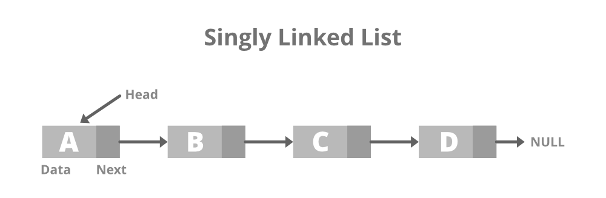

# Estruturas de Dados em Java: Listas

Diferente de Pilhas e Filas, a Lista é indexada.

## Listas Encadeadas

    static class Node {
        int data;
    
        // Pointer to next node in LL
        Node next;
    };

Referência de entrada apontando para o primeiro nó, cada nó com referência para o nó posterior, até o último apontar para null.

- Método **Add**:  Um nó _n-1_ tem referência apontando para o nó inserido _n_, e esse aponta para o próximo nó _n+1_ (ou referência de entrada e/ou null).
- Método **Remove**: Um nó _n_ passa sua referência de _n+1_ para o nó anterior _n-1_.
- Método **Get**: Passa a referência de um nó.

## Listas Duplamente Encadeadas

    static class Node {
        int data;
    
        // Pointer to next node in DLL
        Node next;
    
        // Pointer to the previous node in DLL
        Node prev;
    };

Referência de entrada apontando para o primeiro nó, e referência de último nó apontando para o... último nó. O que é diferente da referência de nó anterior do primeiro elemento e a referência de nó posterior do último elemento, ambas apontando para null.

## Lista Circular

    static class Node {
        int data;
    
        // Pointer to next node in CLL
        Node next;
    };

Também pode ser considerada com uma _tail_ para entrada da lista e uma _head_ para último elemento.

## Fontes

[geeksforgeeks](https://www.geeksforgeeks.org/types-of-linked-list/)
