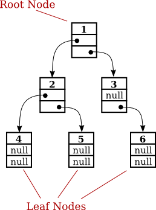

# Estruturas de Dados em Java: Árvores

Estrutura de dados bidimensional. não linear, constituída de nós que representam um modelo hierárquico (dados com base em relações de dependências).

Árvore Hierárquica

- **Raiz** (Root);
- **Nó** (Node);
- **Pai** e **Filho** (Parent and Child);
- **Irmão**  (Sibling);
- **Nível de um Nó** (Level);
- **Altura** / **Profundidade** (Height);
- **Folha** / **Nó Terminal* (Leaf Nodes);
- **Subárvore** (Subtree);
- **Nó Interno**;
- **Grau de um Nó**: Número de filhos;

## Tipos

- Binária: Maiores à direita, menores à esquerda;
- AVL;
- Ordenada;
- Rubro-Negra;
- 2-3;
- 2-4;
- B;
- B+;
- Hiperbólica;

## Árvore Binária

Nó: Object(), noEsq e noDir.

    class Node {
        int key;
        Node left, right;
    
        public Node(int item)
        {
            key = item;
            left = right = null;
        }
    }

### Interface Comparable

Serve para comparar Strings com Strings, ints com ints, etc.

### Inserção

Percorre a árvore até chegar a um nó folha condizente. Após comparação, define se fica à esquerda ou à direita.

### Exclusão

Exclusão da **raiz**: Pega o maior elemento da esquerda (menor do que a raiz) e o transforma em raiz (garante que todos os nós à esquerda são menores do que ele).

Exclusão de um **elemento**: Substitui pelo maior elemento da esquerda.

### Atravessamento

**IN-ORDEM**: Visita o nó a esquerda, exibe o nó, e vistia o nó a direita. Valores em ordem crescente.

**PRÉ-ORDEM**: Exibe a raiz, vai para as subarvores a esquerda, e depois a direita. Valores em diagonal.

**PÓS-ORDEM**: Contrario do pré, visita primeiro e depois exibe.

## Fontes

[geeksforgeeks](https://www.geeksforgeeks.org/binary-tree-data-structure/)
