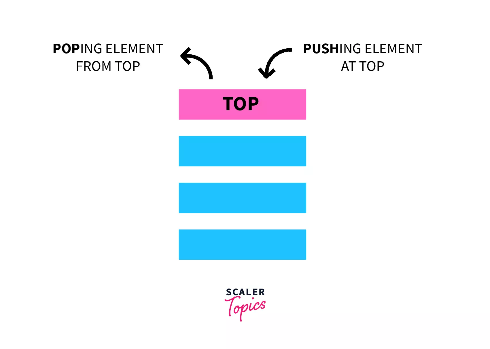
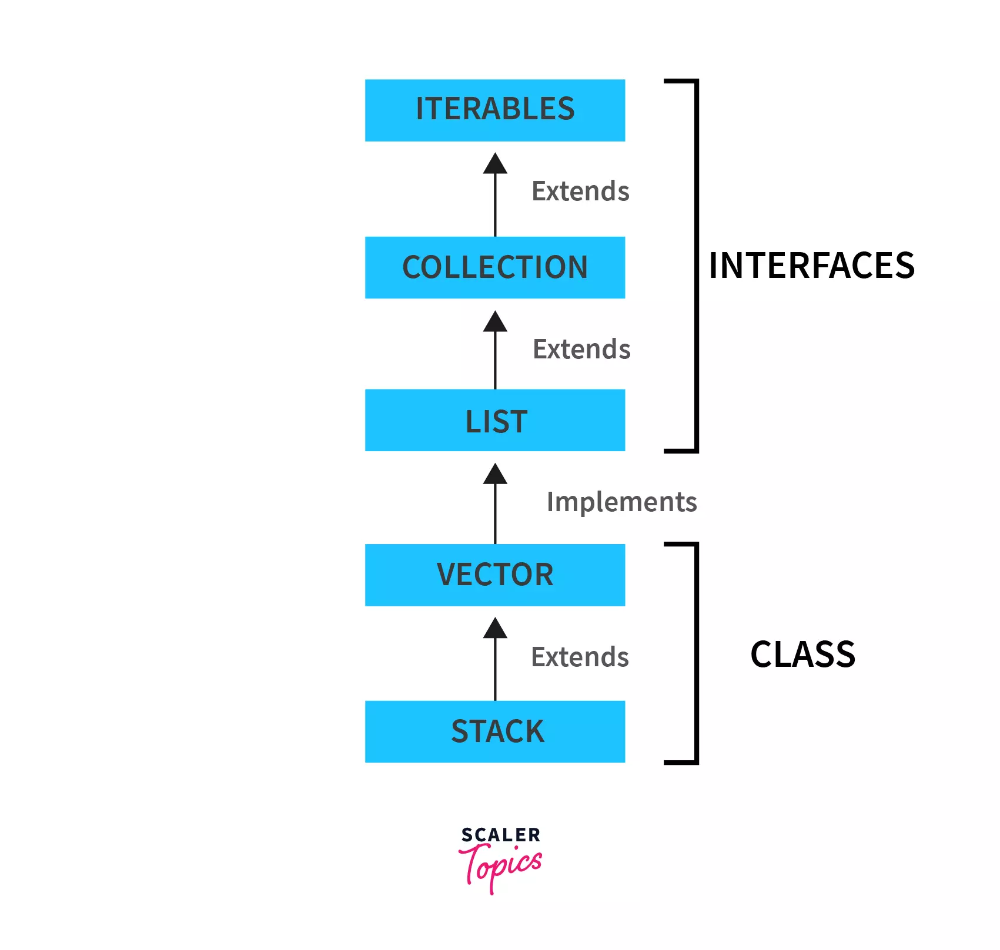
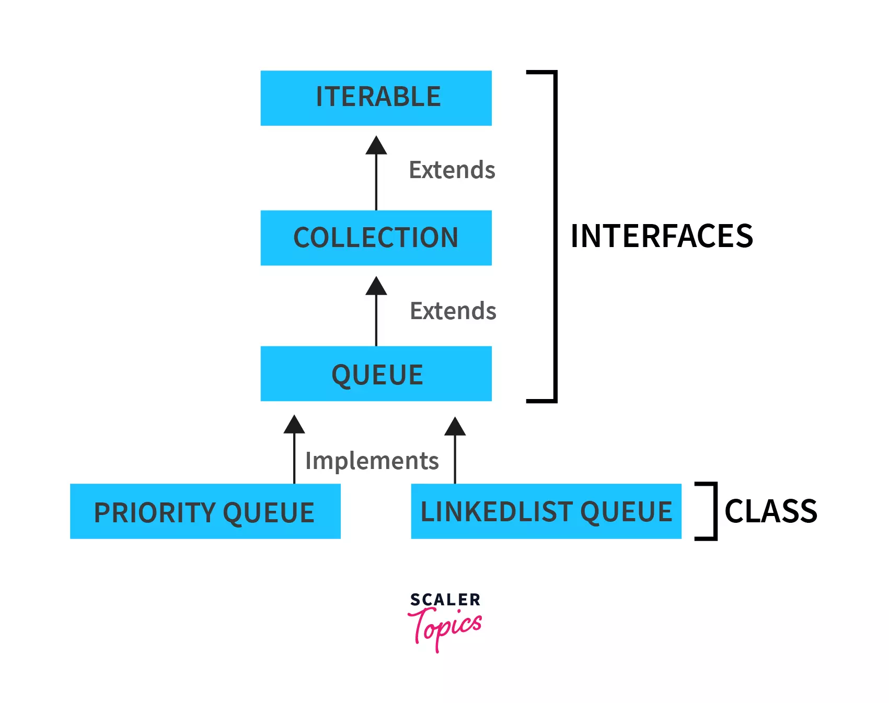
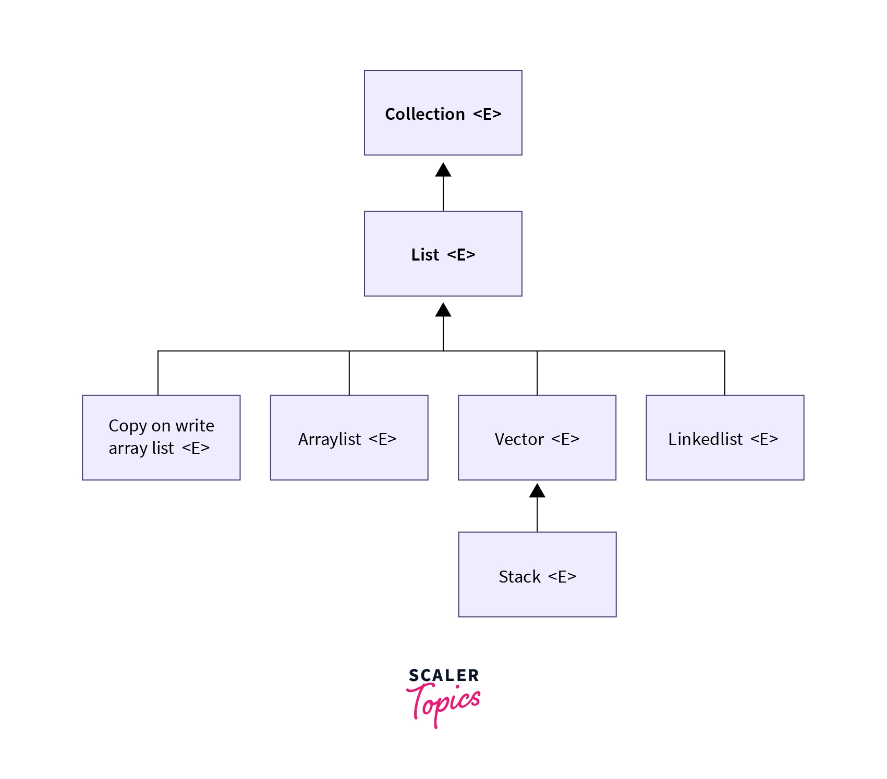
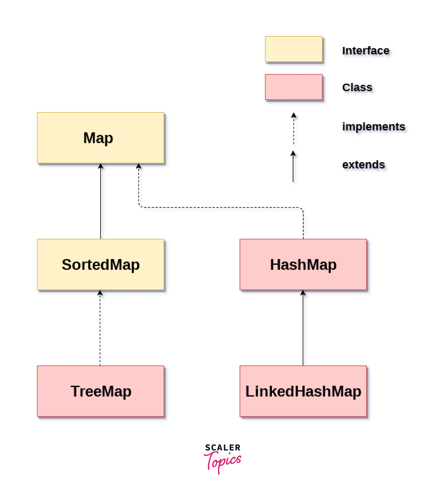

# Estruturas de Dados em Java: Principais Implementações

[java.utils](https://docs.oracle.com/javase/8/docs/api/java/util/package-summary.html)

## Conceitos de Equals e HashCode

- `hasCode()`: Usado para gerar um código hash para um objeto, o qual é usado em estruturas de dados para otimizar a busca e organização dos objetos.
- `equals()`: Usado para comparar se dois objetos são iguais, verificando se os valores/tipos dos atributos dos objetos são iguais.

```java
    public static void main(String[] args) {
        List<Carro> listaCarros = new ArrayList<>();

        listaCarros.add(new Carro("Ford"));
        listaCarros.add(new Carro("Chevrolet"));
        listaCarros.add(new Carro("Volkswagen"));

        System.out.println(listaCarros);
        System.out.println(listaCarros.contains(new Carro("Ford")));

        Carro carro1 = new Carro("Ford");
        Carro carro2 = new Carro("Ford1");

        System.out.println(carro1.hashCode());
        System.out.println(carro2.hashCode());
        System.out.println(carro1.equals(carro2));
    }
```

```shell
[Carro [marca=Ford], Carro [marca=Chevrolet], Carro [marca=Volkswagen]]
true
2195706
68066005
false
```

## Review

[Scaler Topics](https://www.scaler.com/topics/java/stack-and-queue-in-java/)



## Stack(Pilha)



> public class Stack\<E>\
> extends Vector\<E>

- `java.util.Stack`: Representa uma pilha LIFO;
  - `push(E item)`: Adiciona um elemento ao topo da pilha;
  - `pop()`: Remove e retorna o elemento do topo da pilha;
  - `peek()`: Retorna o elemento do topo (sem remoção);
  - `empty()`: Verifica se a pilha está vazia;
  - `search(Object o)`: Retorna a posição de um objeto na pilha;
- Aprimorada em `java.util.Deque`;

```java
    public static void main(String[] args) {
        Stack<Carro> stackCarros = new Stack<>();

        stackCarros.push(new Carro("Ford1"));
        stackCarros.push(new Carro("Chevrolet2"));
        stackCarros.push(new Carro("Fiat3"));

        System.out.println(stackCarros);
        System.out.println(stackCarros.pop());
        System.out.println(stackCarros);
    }
```

```shell
[Carro [marca=Ford1], Carro [marca=Chevrolet2], Carro [marca=Fiat3]]
Carro [marca=Fiat3]
[Carro [marca=Ford1], Carro [marca=Chevrolet2]]
```

## Queue(Fila)



> public interface Queue\<E>\
> extends Collection\<E>

- `java.util.Queue`: Representa uma fila FIFO;
  - Implementações incluem `java.util.LinkedList` e/ou `java.util.PriorityQueue`;
  - Possui operações com exceções em caso de falhas, e outra que retorna um valor especial (null ou false);
  - `add(E e)`/`offer(E e)`: Insere um elemento no head da fila;
  - `remove()`/`poll()`: Retorna e remove o elemento no head;
  - `element()`/`peek()`: Retorna, sem remover, o elemento no head;

```java
    public static void main(String[] args) {
        Queue<Carro> queueCarros = new LinkedList<>();

        queueCarros.add(new Carro("Ford1"));
        queueCarros.add(new Carro("Chevrolet2"));
        queueCarros.add(new Carro("Fiat3"));

        System.out.println(queueCarros.offer(new Carro("Renault4")));
        System.out.println(queueCarros);

        System.out.println(queueCarros.peek());
        System.out.println(queueCarros);

        System.out.println(queueCarros.poll());
        System.out.println(queueCarros);

        System.out.println(queueCarros.isEmpty());
    }
```

```shell
true
[Carro [marca=Ford1], Carro [marca=Chevrolet2], Carro [marca=Fiat3], Carro [marca=Renault4]]
Carro [marca=Ford1]
[Carro [marca=Ford1], Carro [marca=Chevrolet2], Carro [marca=Fiat3], Carro [marca=Renault4]]
Carro [marca=Ford1]
[Carro [marca=Chevrolet2], Carro [marca=Fiat3], Carro [marca=Renault4]]
false
```

## List(ArrayList)



> public interface List\<E>\
> extends Collection\<E>

- `java.util.List`: Representa uma coleção ordenada de elementos.
  - Permite elementos serem acessados por índice e duplicatas serem criadas.
  - Implementações comuns incluen `java.util.ArrayList`, `LinkedList` e `Vector`.
- `add(E element)`: Adiciona elemento ao final da lista;
- `add(int index, E element)`: Adiciona elemento na posição indicada;
- `get(int index)`: Retorna elemento da posição;
- `remove(int index)`: Remove elemento da posição;
- `size()`: Retorna o número de elemntos na lista;
- `isEmpty()`: Verifica se a lista está vazia;

```java
    public static void main(String[] args) {
        List<Carro> listCarros = new ArrayList<>();

        listCarros.add(new Carro("Ford1"));
        listCarros.add(new Carro("Chevrolet2"));
        listCarros.add(new Carro("Fiat3"));
        listCarros.add(new Carro("Peugeot4"));
        System.out.println(listCarros);
        System.out.println(listCarros.contains((new Carro("Ford1"))));
        System.out.println(listCarros.get(2));
        System.out.println(listCarros.indexOf(new Carro("Fiat3")));
        System.out.println(listCarros.remove(2));
        System.out.println(listCarros);
    }
```

```shell
[Carro [marca=Ford1], Carro [marca=Chevrolet2], Carro [marca=Fiat3], Carro [marca=Peugeot4]]
true
Carro [marca=Fiat3]
2
Carro [marca=Fiat3]
[Carro [marca=Ford1], Carro [marca=Chevrolet2], Carro [marca=Peugeot4]]
```

## Set(HashSet)

> public interface Set\<E>\
> extends Collection\<E>

- `java.util.Set`: Representa uma coleção não ordenada que não permite elementos duplicados.
  - Pode conter no máximo um elemento nulo;
  - Não garante uma ordem específica dos elementos;
  - Modela abstração matemática de conjunto;
- `add(E e)`: Adiciona o elemento especificado ao conjunto;
- `addAll(Collection<? extends E> c)`: Adiciona todos os elementos da coleção, se eles não estiverem presente.
- `remove(Object o)`: Remove o elemento especificado do conjunto.
- `contains(Object o)`: Verifica se o conjunto contém o elemento especificado
- `size()`: Retorna o número de elementos no conjunto.
- Implementa:

  - `java.util.HashSet`: Usa uma tabela de dispersão para armazenar os elementos;
  - `java.util.TreeSet`: Mantém os elementos em ordem natural ou definida por um comparador;
  - `java.util.LinkedHashSet`: Mantém a ordem de inserção dos elementos;

```java
public static void main(String[] args) {
    Set<Carro> hashSetCarros = new HashSet<>();

    hashSetCarros.add(new Carro("Ford1"));
    hashSetCarros.add(new Carro("Chev2"));
    hashSetCarros.add(new Carro("Fiat3"));
    hashSetCarros.add(new Carro("Peug4"));
    hashSetCarros.add(new Carro("Zip5"));

    System.out.println(hashSetCarros);
}
```

```shell
[Carro [marca=Fiat3], Carro [marca=Zip5], Carro [marca=Ford1], Carro [marca=Chev2], Carro [marca=Peug4]]
```

Para utilizar árvore, é preciso que o objeto seja comparável:

```java
    @Override
    public int compareTo(Carro o) {
        return this.getMarca().compareTo(o.getMarca());
    }
```

```java
    public static void main(String[] args) {
        Set<Carro> treeSetCarros = new TreeSet<>();

        treeSetCarros.add(new Carro("Ford1"));
        treeSetCarros.add(new Carro("Chevro2"));
        treeSetCarros.add(new Carro("Fiat3"));
        treeSetCarros.add(new Carro("Peugot4"));
        treeSetCarros.add(new Carro("Zip5"));

        System.out.println(treeSetCarros);
    }
```

```shell
[Carro [marca=Chevro2], Carro [marca=Fiat3], Carro [marca=Ford1], Carro [marca=Peugot4], Carro [marca=Zip5]]
```

## Map(HashMap)



> public interface Map\<K,V>

- `java.util.map`: Usada para criar coleções de pares chave-valor.
  - Cada chave em um mapa está vinculada a um valor específico.
  - Não é permitido ter chaves duplicadas. Cada chave pode mapear para no máximo um valor;
