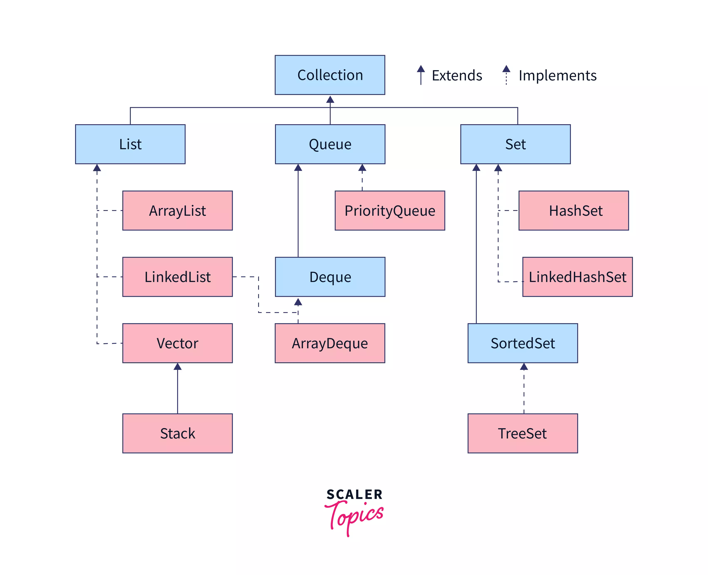
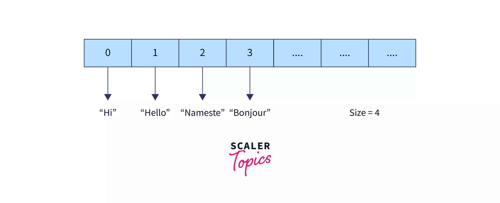
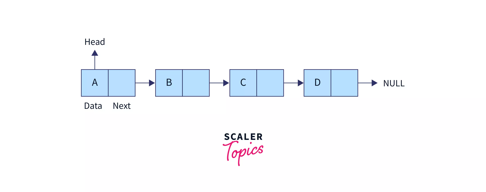
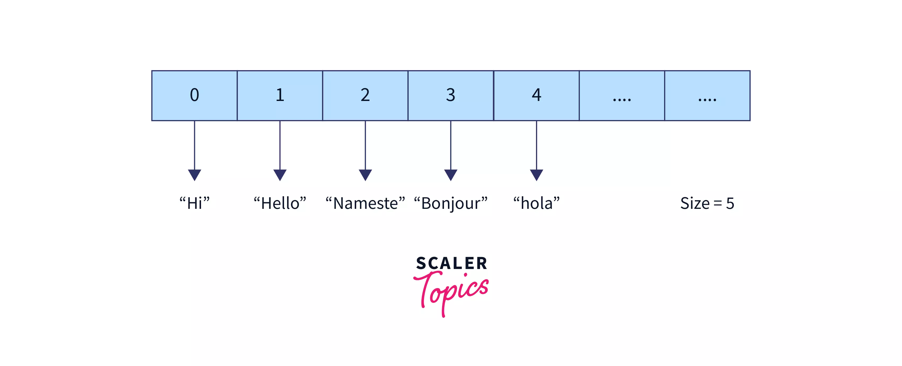
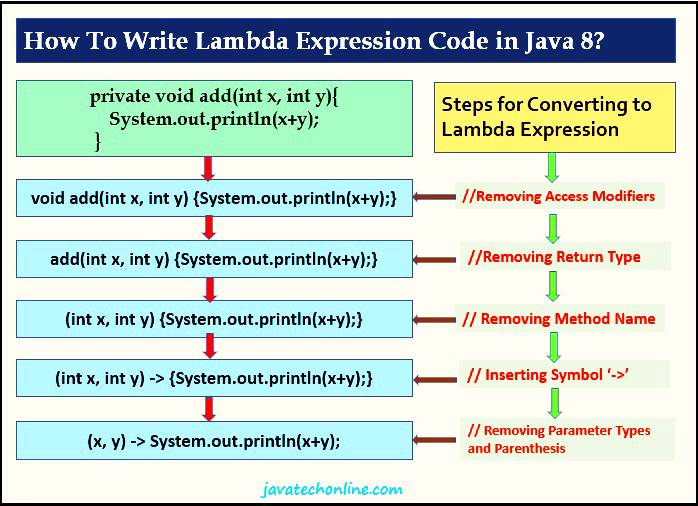
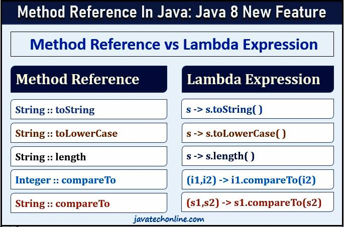
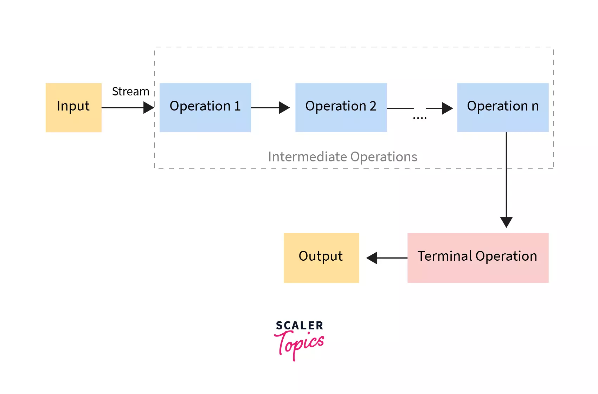

# Trabalhando com Collections Java

[Collections in Java](https://www.scaler.com/topics/java/collections-in-java/)

[Collections Framework](https://docs.oracle.com/javase/8/docs/technotes/guides/collections/index.html)

> Collection é um objeto que representa um grupo de objetos, denominados elementos, como uma única unidade.

Serve para armazenar e processar conjuntos de dados eficientemente.



**Collection** (herdeira de **java.lang.Object**) é a raiz do framework Java **Collections**, sendo extendido por List, Queue e Set. Herdeiro de **Object**

- Descendentes básicos:
  - `java.util.Set`
  - `java.util.SortedSet`
  - `java.util.NavigableSet`
  - `java.util.Queue`
  - `java.util.concurrent.BlockingQueue`
  - `java.util.concurrent.TransferQueue`
  - `java.util.Deque`
  - `java.util.concurrent. BlockingDeque`
  - `java.util.List`
  - ...
- Descendentes não verdadeiros, baseados em `java.util.Map`:
  - `java.util.SortedMap`
  - `java.util.NavigableMap`
  - `java.util.concurrent.ConcurrentMap`
  - `java.util.concurrent.ConcurrentNavigableMap`

**Collections Framework** é uma arquitetura unificada para representar e manipular coleções. Em Java, é uam hierarquia de interfaces e classes que fornece fácil gerenciamento de um grupo de objetos.

## List

> public interface List\<E>
> extends Collection\<E>

`java.util.List` é uma coleção ordenada (sequência) que pode conter duplicatas.



`java.util.ArrayList`: Implementação dimensionada dinamicamente da interface List Rápido para acesso por índice, mas custoso para aumentar o tamanho.



`java.util.LinkedList`: Implementação duplamente conectada das interfaces List e Deque. Eficiente para inserção/remoção, mas mais lenta para acesso por índice.



`java.util.Vector`: Similar ao ArrayList, mas sendo sincronizado. Seguro para uso em threads concorrentes, mas menos usado devido à sincronização e desempenho inferior.

## Set

> public interface Set\<E>
> extends Collection\<E>

`java.util.Set` é uma coleção, não ordenada, que não contém elementos duplicados.

| **Feature** | **`HashSet`** | **`LinkedHashSet`** | **`TreeSet`** |
|-|-|-|-|
| **Underlying Data Structure** | Hash table | Hash table + Linked list | Red-Black tree |
| **Ordering of Elements** | No order guarantees | Maintains insertion order | Sorted order (natural or custom comparator) |
| **Performance (basic ops)** | average | average (slightly slower due to list)| log(n) |
| **Null Handling** | Can contain one null | Can contain one null | No nulls if natural ordering, depends on comparator otherwise |
| **Memory Overhead** | Moderate | Higher (due to linked list) | Relatively high (due to tree structure) |
| **Use-cases** | General-purpose | When insertion order matters | When sorting or range-queries are needed |
| **Iteration Order** | Unpredictable | Order of insertion | Ascending order of elements |
| **Thread Safety** | Not thread-safe | Not thread-safe | Not thread-safe |
| **Boundaries** | No boundaries | No boundaries | Can have a starting (inclusive) and ending (exclusive) point |

## Map

> public interface Map\<K,V>

`java.util.Map` é um objeto que mapeia chaves a valores, sem valores duplicados.

Similar aos sets, possui HashMap, LinkedHashMap, e TreeMap.

## Stream

### Introdução

**Anonymous Classes**: É uma classe aninhada que não tem nenhum nome. Uma classe anônima deve ser definida dentro de outra classe. É útil quando se quer criar uma instância com características extras, sem precisar criar uma subclasse.

```java
class Scaler {

    // Definition of anonymous inner class
    Object obj = new SuperType(constructorArguments) {
        // anonymous class body
    }
}
```

**Functional Interfaces**: Uma interface funcional é uma interface que contém apenas um método abstrato, um método declarado sem corpo (Single Abstract Method). Ela serve como um modelo para expressões lambda.

```java
// interface
@FunctionalInterface   // annotation
interface interfaceName{
    // abstract method 
    abstract returnType methodName( /* parameters */);
    
    // default or static methods
    
    int method1(){
        // ....
    }
    String method2(int x, float y){
        // ....
    }
}

// public class
public class className{
    // main method
    public static void main(String[] args){
        interfaceName temp = (/*parameters*/) -> {
            // perform operations 
        };
        
        temp.methodName(); // call abstract method of the interface
    }
}
```

São tipos de **Functional Interfaces**:

```java
//A interface funcional do tipo de função recebe um único argumento, processa-o e retorna um valor.
@FunctionalInterface
public interface Function<T, R>{
    R apply(T t);
}
```

A função tem dois tipos genéricos. O primeiro `T` é o tipo que toma um parâmetro e `R` é o tipo de retorno do método abstrato. `apply()` (aplica esta função ao argumento fornecido) é o método abstrato da Função.

```java
// A interface funcional do supplier em Java é parecida com uma interface funcional, mas não aceita argumentos. Ao chamar o supplier, ele simplesmente retorna um valor.
@FunctionalInterface
public interface Supplier<T>{
    T get();
}
```

O supplier leva apenas um tipo genérico, o tipo de dados que vai retornar. get(), cujo objetivo é fornecer/produzir um valor do tipo especificado, é o método abstrato do Fornecedor.

```java
// A interface funcional do consumer em Java aceita um único argumento gentrificado e não retorna nenhum valor.
@FunctionalInterface
public interface Consumer<T>{
    void accept(T t);
}
```

O consumer leva um tipo genérico e `accept()` é o método abstrato do Consumer.

```java
// A interface funcional do predicate em Java usa um único argumento e retorna um valor booleano.
public interface Predicate<T>{
    boolean test(T t);
}
```

**Lambda**: Função sem declaração (acesso, tipo e nome). A expressão Lambda em Java é um recurso que permite implementar interfaces de uma função (interfaces funcionais) de forma mais simples e concisa.



```java
// Before Java 8
MyInter person = new MyInter() {  
    @Override 
    public void MyInterMethod() {
        System.out.println("Before Java 8 without lambda");
    }  
};

// Java 8: Using lambda expression
MyInter p2 = () -> {
    System.out.println("Lambda implemented");
};
```

```java
// No Parameter Syntax        
() -> {body of function}
// One Parameter Syntax
( p1 ) -> {body of function}
// Two Parameter Syntax
( p1, p2 ) -> {body of function}
```

**Reference Method**: Recurso que permite fazer referência a um método ou construtor de uma classe (de forma funcional) e assim indicar que ele deve ser utilizado em um ponto específico do código, deixando-o mais simples e legível. É indicado pelo uso de `::`.



```java
// Criação de uma Lista de Strings
List<String> messages = Arrays.asList("hello", "baeldung", "readers!");
// Para cada elemento da lista, aplica-se o método capitalize como callback
messages.forEach(StringUtils::capitalize);
```

### Streams API

**Streams API** permite processar sequências de elementos (Collections) de maneira declarativa, paralela e funcional.

Uma Stream é uma sequência de elementos que pode ser processada de forma eficiente.
Ela não armazena dados, mas permite operações em seus elementos.



Características:

- **Declaratividade**: As operações são expressas de forma declarativa, focando no “o quê” em vez do “como”.
- **Lazy Evaluation**: As operações não são executadas até que sejam necessárias.
- **Pipeline**: As operações podem ser encadeadas em um pipeline.
