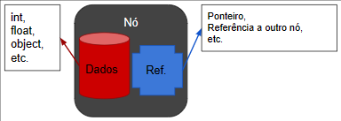
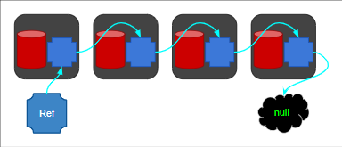

# Estruturas de Dados e API de Streams

- Introdução:
  - Atribuição e Referência
  - Nó

    

  - Encadeamento

    

  - Generics
    - Wildcards
- Pilhas (LIFO)
  - Top
  - Push
  - Pop
- Filas (FIFO)
  - Enqueue
  - Dequeue
- Listas Encadeadas
- Listas Duplamente Encadeadas
- Listas Circulares
- Árvores
- Collections

## Projetos

- [Abstraindo um Bootcamp Usando Orientação a Objetos em Java](https://github.com/Err0rGCeni/DIOProject_Bootcamp-OOP)
